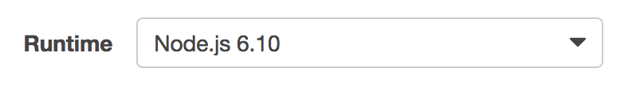
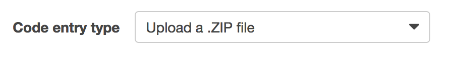
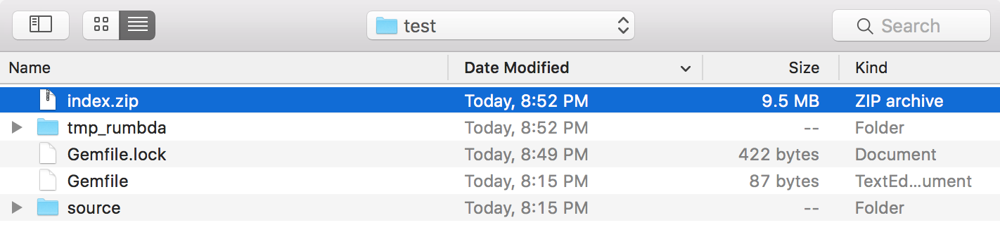
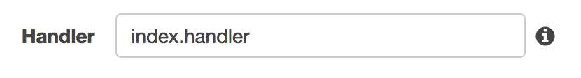

# rumbda [](https://travis-ci.org/kleaver/rumbda) [](https://badge.fury.io/rb/rumbda)
Run ruby scripts on aws lambda.

## Installation
```
gem install rumbda
```
or add it to the Gemfile

```
group :development do
  gem 'rumbda'
end
```

## What does rumbda do?
Rumbda does everything necessary to build a zip file for running ruby inside of an AWS Lambda. This includes downloading [traveling ruby](https://github.com/phusion/traveling-ruby), creating a bundle of the project's Gemfile dependencies, and creating a consumable .zip file for use with Lambda.

## Getting Started
Run `rumbda init` in the directory you'd like to have your Lambda project. This will create the following files in the current directory: `source/main.rb`, `Gemfile`, `.gitignore`, and `.ruby-version`. `source/main.rb` is the entry point to the ruby script. The `Gemfile` and `Gemfile.lock` are where gems are specified.

## Building the zip
```
rumbda build
# => creates a file "index.zip" which contains all files in "source/" and all gems specified in the "Gemfile"
```

### Configuring the Lambda
1. Set **Runtime** to `Node.js 6.10`.

    
1. Set **Code entry type** to `Upload a .ZIP file`.

    
1. In the **Function package** upload `index.zip` (the zip created by `rumbda build`).

    
1. Set **Handler** to `index.handler`.

    

## Example
See the [example folder](example/) for what a project using rumbda might look like.
```
pwd
#=> ~/rumbda/example
ruby --version
#=> 2.2.2
bundle install
#=> installs dependencies, creates Gemfile.lock
bundle exec rumbda build
#=> builds the index.zip file
```
After the index.zip file is built, follow the steps for [Configuring the Lambda](#configuring-the-lambda).

## Environment Variables and Events
Lambda environment variables are available to main.rb via `ENV['<variable name>']`.  See [the example](example/source/main.rb#L8).

The Lambda Event is available to the script via `ARGV[0]`.  See [the example](example/source/main.rb#L9).
If testing the script locally, simply pass in a json as the first argument to the script:
```
$ ruby main.rb "$(cat test_event.json)"
```

## Return JSON for API Gateway
If needing to return JSON from your lambda (e.g. for use in AWS API Gateway) write to a file path provided in your lambda's environment at key 'RUMBDA_RESULT_JSON_FILENAME'.

```ruby
File.open(ENV['RUMBDA_RESULT_JSON_FILENAME'], 'w') do |file|
  file.write(JSON.dump({ statusCode: 200, body: '' }))
end
```

The file contents should be valid JSON.

## Command Reference
| Command        | Purpose                                                                                                                    |
|:---------------|:---------------------------------------------------------------------------------------------------------------------------|
| `rumbda init`  | Initializes a directory as rumbda project.                                                                                 |
| `rumbda build` | Packages everything in `./source/` directory as well as gems specified in the `Gemfile` into a zip file called `index.zip` |
